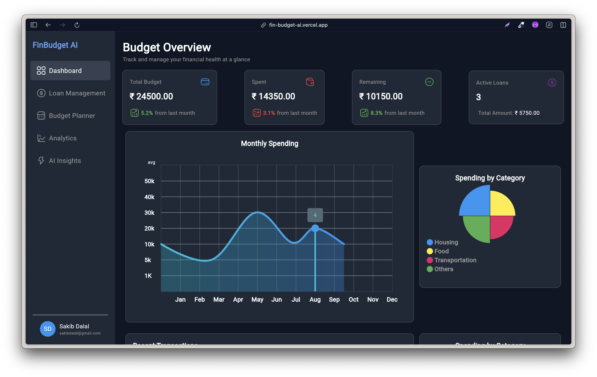

# FinBudget AI

Web App Prototype Link's:
- https://fin-budget-ai.vercel.app/
- Note: The app is currently in development and it's prototype so screen resolution is available for only PC, Laptop Screens.
- Another prototype link (complete): https://finbudget-ai61gp.rollout.site

## Screen Shot

## Introduction 
- Financial mismanagement and lack of financial literacy lead to poor money habits, increasing debt, and financial stress.
- Many individuals struggle with budgeting, tracking expenses, and making informed financial decisions.
- FinBudget AI is designed to solve these problems by leveraging AI-driven insights, helping users gain control over their finances.
- From budgeting and expense tracking to loan optimization and financial forecasting, FinBudget AI provides a comprehensive solution to achieve financial stability and growth.

## Why Financial Management Matters?
1. Lack of financial knowledge often results in overspending, accumulating debt, and poor savings habits.
2. Budgeting, saving, and investing can be overwhelming without proper guidance, making long-term financial planning difficult.
3. Lack of financial knowledge often results in overspending, accumulating debt, and poor savings habits.
   
## Key Features of FinBudget AI
- Budget Overview: Track and manage financial health at a glance.
- Spending Tracker: Monitor monthly, quarterly, and yearly expenses.
- Expense Categorization: Identify areas where money is spent the most.
- Loan Management: Optimize loans with AI-driven insights.
- Analytics Dashboard: View financial health scores, trends, and future predictions.
  
## AI-Powered Insights
- AI Goal Planner: Set and track financial goals.
- Loan Simulator: Compare loan types and AI-based recommendations.
- Smart Budget Assistant: AI-generated budgeting tips.

## Loan Management
- Active Loans: Monitor ongoing loans and track repayment progress.
- AI Loan Optimization: Get personalized suggestions to reduce interest costs and manage debt efficiently.
- Payment Schedule: View the next five upcoming payments for selected loans to plan finances better.
- Loan Amortization: Understand loan repayment structures and visualize how payments impact overall loan balance.

## Investment & Tax Optimization
- Investment Analysis: Gain insights into your investment portfolio, assess risk levels, and identify diversification opportunities to maximize returns.
- Tax Optimizer: Receive AI-driven tax-saving strategies, ensuring compliance while optimizing deductions and credits to reduce tax liabilities.
- Income vs. Expenses Tracking: Maintain a clear overview of your earnings and expenditures, helping you make informed financial decisions and adjust spending habits for better savings and investment planning.

## Visual Analytics Dashboard
- Spending Heatmap: Identify patterns in your spending and recognize periods of high expenses, helping you adjust financial habits for better savings.
- Category Breakdown: Analyze spending distribution across different categories, providing clarity on where your money is going and allowing for smarter budget adjustments.
- Predictive AI Insights: Receive personalized financial recommendations based on past spending trends, enabling better planning and smarter financial decisions for the future.

## Technological Stack
- Frontend: Flutter (for web development, ensuring a responsive and dynamic UI)
- Backend: AWS Lambda Functions (serverless architecture for efficient backend operations)
- Database: DynamoDB (NoSQL database for scalable and real-time financial data management)
- AI Integration: Ollama (for AI-driven financial insights, predictions, and recommendations)